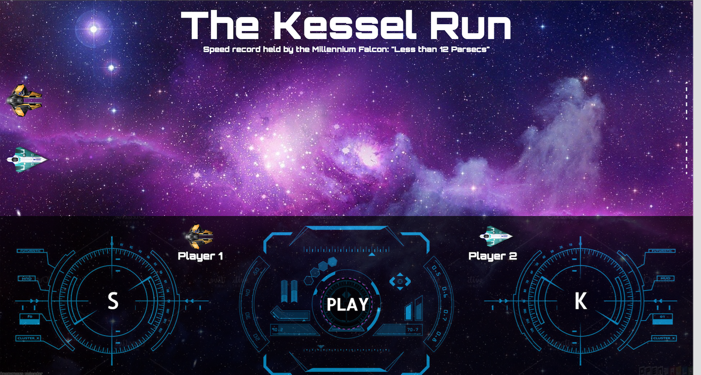

# Project Name
Project-0: The Kessel Run
A two player browser based spaceship racing game where players can compete to see if they have what it takes to survive as a spice smuggler.

# Goals
Create a browser based racing game that uses key strokes as the method of movement and prompts who the winner is.

## Technologies
HTML, CSS, javascript, jQuery, Boostrap 3.3.6, jQuery UI

## Missed goals
Save and display player win counts
Add a reset button to reset the game pieces
Add a key lock function that prevents game pieces from being moved until countdown timer completes

## Known issues (bugs)
Due to time constraints, this game only looks good on a full screen 15inch laptop screen
Welcome dialog resizes the background
Win dialog flickers and slightly shifts the game window
Play button defaults to original styling in "active" mode
HUD does not touch the bottom of the screen
Dialog Close buttons are not properly positioned

## Thinking ahead
Would be cool if I could get the moves to be turn based using pop ups to ask math questions, trivia, or typing challenges. Distance moved would be dependent on time it took to complete the challenge.

Want to create difficulty settings that would toggle the amount of times a user had to hit a key before moving forward (possible change the amount of pixels the game piece moves)

Player choice in game pieces

Multiple levels, possibly give the option to change background after the game is completed in a certain amount of time.

## Resources
Stackoverflow - http://stackoverflow.com/
Mozilla Developer Network - https://developer.mozilla.org
jQuery API - http://api.jquery.com/
jQuery UI - http://jqueryui.com/
Jon Duckett: javascript & jQuery - http://javascriptbook.com/

## Credits
Spaceship game pieces - http://findicons.com/
Background image - http://mxxcs.ru/stars-in-space-background
Level text - http://starwars.wikia.com/wiki/Kessel_Run
Fonts -https://fonts.google.com
HUD images - http://www.alamy.com/
Star Wars rights owned by Disney
